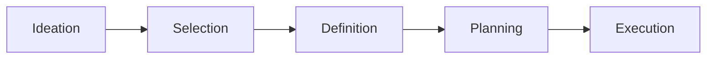

# Getting Unstuck

When I'm looking at my engineering notebook it's often in the context of "I'm stuck and I don't know what to do."  Here are some things that often work:

* Make a list
  * For writing, this can also be "make an outline"
* Look at the [patterns and antipatterns](https://www.divergentpatterns.com)

## The Process of Work

1. **Ideation** of goals.
1. **Selection** of a goal.
1. **Definition** of what "done" looks like.
1. **Planning** how you will proceed.
1. **Execution** of the plan.

Each of these steps is successively more specific, and a failure to accomplish one step will make the steps that follow harder to accomplish.  Therefore, it follows:

* If you don't know how to **execute**, go back to **planning**.
* If you can't make a **plan**, you need to flesh out your **definition** of done.
* If you're not clear on what **done** looks like, you need to **select** a goal.
  * If the goal is too big to conceptualize, make a high level DoD and then set milestones.
  * If those milestones are still too big, repeat this process until you have milestones you can actually visualize and plan out.
* If you don't have a goal, it's time to work on **ideation**.

Here's an example:

### Ideation of Goals

* Have a clean house
* Have a cash positive budget
* Redo my office

### Selection of a Goal

Let's prioritize having a clean house.

### Definition of Done

This is a really big goal.  It might be a good idea to make some milestones.

* Have a clean house
  * Clean living room
  * Clean kitchen
  * Clean bedroom
  * Clean bathroom
  * Clean basement

And for right now, I'll work on the kitchen.  

The kitchen can be considered clean when:

* Dishes are caught up
* Trash is taken out
* Counters are cleared and wiped down
* Stove is wiped down

### Planning

1. Run a load of dishes in the dishwasher
1. Collect and take out trash
1. Put away the cereal boxes on the counter
1. Wipe down the counters
1. Wipe down the stove
1. Continue running the dishwasher as it completes cycles

### Execution

At this point, it's just a matter of running down the plan and doing the things.

