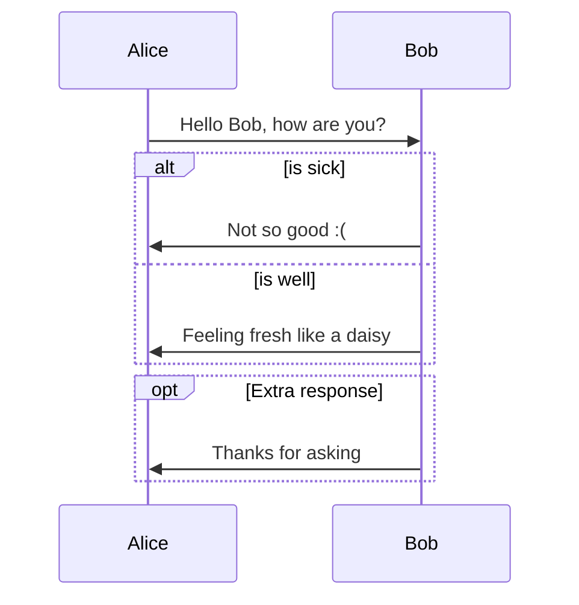

# Drawing Diagrams in Typora

Documentation: https://support.typora.io/Draw-Diagrams-With-Markdown/


## Sequence Diagrams

Uses [js-sequence](https://bramp.github.io/js-sequence-diagrams/):

~~~console
```sequence
Alice->Bob: Hello Bob, how are you?
Note right of Bob: Bob thinks
Bob-->Alice: I am good thanks!
```
~~~

```sequence
Alice->Bob: Hello Bob, how are you?
Note right of Bob: Bob thinks
Bob-->Alice: I am good thanks!
```

## Flowcharts

Uses [flowchart.js](http://flowchart.js.org/)

````console
```flow
st=>start: Start
op=>operation: Your Operation
cond=>condition: Yes or No?
e=>end

st->op->cond
cond(yes)->e
cond(no)->op
```
````

```flow
st=>start: Start
op=>operation: Your Operation
cond=>condition: Yes or No?
e=>end

st->op->cond
cond(yes)->e
cond(no)->op
```

## Mermaid Integration

Mermaid Documentation:  https://mermaid.js.org/syntax/classDiagram.html

````console

````


