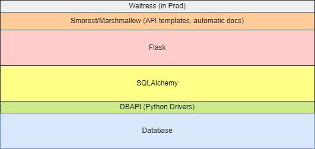

# Overview

This documentation details how to build a RESTful microservice API using the following tech stack:

| Element                       | Technology                |
| ----------------------------- | ------------------------- |
| Core language                 | Python                    |
| Database                      | SQLite (but could be any) |
| Web server                    | Flask[1]                  |
| Database Connectivity Library | SQLAlchemy                |
| API templates, documentations | Smorest/Marshmallow       |

[1] Should be changed to use Waitress or another production ready web server.

We will be focusing on the bits between the Waitress and Database layers.  

Here are the steps we will be following:

| Step            | Purpose                                                      |
| --------------- | ------------------------------------------------------------ |
| Project Setup   | Organizing code for development.                             |
| Endpoint Design | Tips on how to design good RESTful interfaces.               |
| Schemas         | The schemas represent the messages flowing in from and out to the client. |
| Endpoints       | The endpoints define the URLs clients can hit and contain the business logic represented by that endpoint. |
| Testing         | While it's more effective to write tests as you're writing your code, it's easier to explain testing in context of code that is already written.  So, while we are exploring testing at the end of this set of documents, we heartily recommend writing your tests as you write your code. |

This documentation assumes a basic understanding of object oriented programming, SQL, and Python.  While there are many code examples which can be copied and reused, a deep discussion of Python is outside the scope of this documentation.
